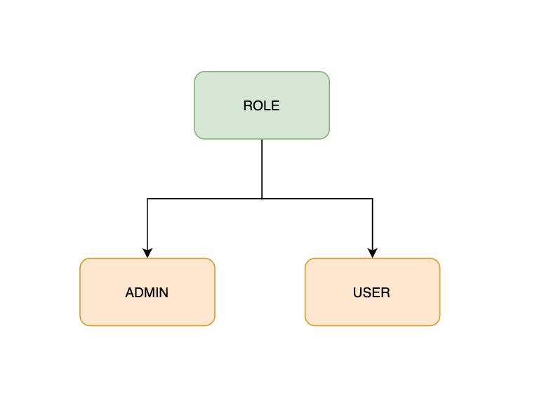
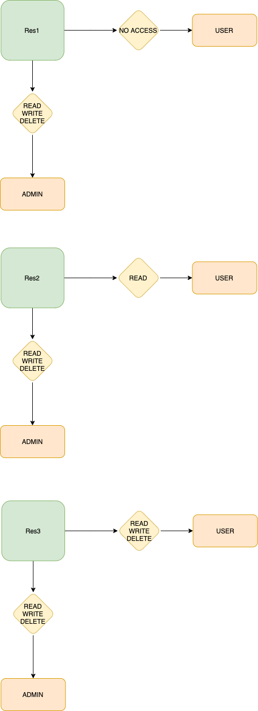

# bst-assignment
1. Clone the repository
2. Install the node modules (npm install)
3. Start the server (npm start)

## Currently populated users in the system
```
email: admin@gmail.com
password: 1234
role: ADMIN

email: user1@gmail.com
password: 1234
role: USER
```

## Currently populated roles in the system



## Currently populated resources with their role based access configuration in the system




## Command-line interaction example
```
> ts-server@1.0.0 start /Users/gamechange/Personal/assignments/role-based-access
> npm run build && node dist/server.js


> ts-server@1.0.0 build /Users/gamechange/Personal/assignments/role-based-access
> tsc

? Enter user email: admin@gmail.com
? Enter user password: [hidden]
? 
Press 1 for login as another user
Press 2 for creating new user
Press 3 for getting users list
Press 4 for editing user role
Press 5 for accessing resource
Press 6 for exit
: 1
? Enter user email: user1@gmail.com
? Enter user password: [hidden]
? 
Press 1 for login as another user
Press 2 for viewing your roles
Press 3 for accessing resource
Press 4 for exit: 2
Roles are:  ["USER"]
? 
Press 1 for login as another user
Press 2 for viewing your roles
Press 3 for accessing resource
Press 4 for exit: 3
? Please enter action type: WRITE
? Please enter resource name: Res2
Permission denied!
? 
Press 1 for login as another user
Press 2 for viewing your roles
Press 3 for accessing resource
Press 4 for exit: 3
? Please enter action type: READ
? Please enter resource name: Res2
Permission granted!
? 
Press 1 for login as another user
Press 2 for viewing your roles
Press 3 for accessing resource
Press 4 for exit: 3
? Please enter action type: WRITE
? Please enter resource name: Res3
Permission granted!
? 
Press 1 for login as another user
Press 2 for viewing your roles
Press 3 for accessing resource
Press 4 for exit: 4
```
